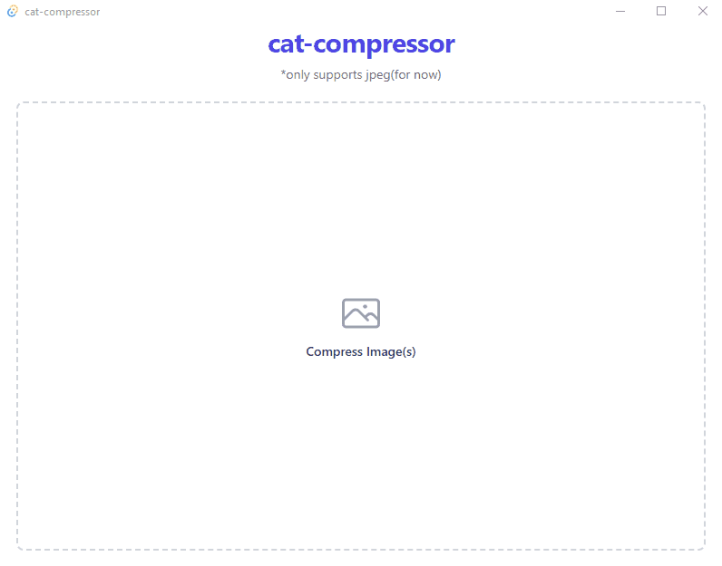

# cat-compressor
An application to compress images. Only supports jpeg/jpg for now. Stores them in the same directory in a folder named "Compressed".

# Demo


# Stack
Built with Tauri. Leveraging Rust for the actual image compression and uses React with TailwindCSS and Zustand for managing the frontend view.

# Development
Run ```pnpm install``` before ``` pnpm tauri dev```.

# Building
Run ```pnpm tauri build```. Binary executable will be in ```src-tauri/target/release/cat-compressor``` and installers will be in ```src-tauri/target/release/bundle/```.